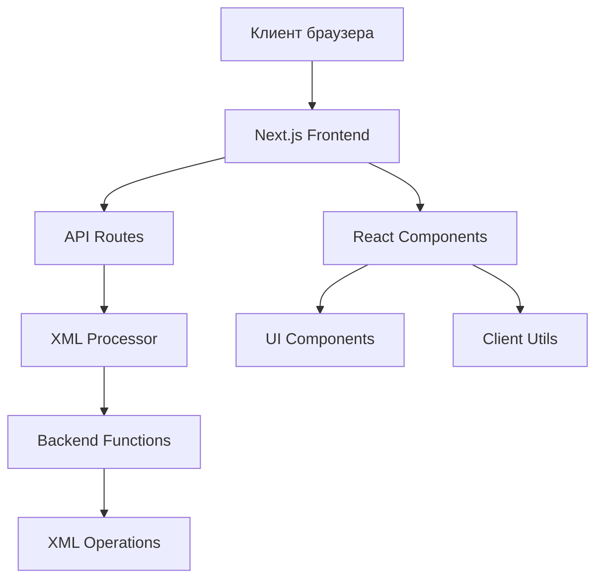

# Руководство разработчика 6-НДФЛ

## Содержание

- [Архитектура приложения](#архитектура-приложения)
- [Настройка среды разработки](#настройка-среды-разработки)
- [Структура проекта](#структура-проекта)
- [Компоненты и модули](#компоненты-и-модули)
- [API и бэкенд](#api-и-бэкенд)
- [Работа с XML](#работа-с-xml)
- [Стилизация и UI](#стилизация-и-ui)
- [Тестирование](#тестирование)
- [Развертывание](#развертывание)
- [Расширение функциональности](#расширение-функциональности)
- [Лучшие практики](#лучшие-практики)

## Архитектура приложения

### Общий обзор

6-НДФЛ построен на базе Next.js 15 с использованием React 19 и TypeScript. Приложение использует серверные и клиентские компоненты для оптимальной производительности.



### Технологический стек

#### Frontend
- **Next.js 15.1.7**: Фреймворк для React с SSR/SSG
- **React 19.0.0**: Библиотека для создания UI
- **TypeScript**: Статическая типизация
- **Tailwind CSS**: Utility-first CSS фреймворк
- **Framer Motion**: Анимации и эффекты
- **Radix UI**: Доступные компоненты

#### Backend
- **Next.js API Routes**: Серверные эндпоинты
- **xml2js**: Парсинг и сборка XML
- **iconv-lite**: Конвертация кодировок
- **Node.js**: Серверная среда выполнения

#### Инструменты разработки
- **ESLint**: Линтинг кода
- **Prettier**: Форматирование кода
- **TypeScript**: Проверка типов

## Настройка среды разработки

### Предварительные требования

```bash
# Проверьте версии
node --version  # >= 18.0.0
npm --version   # >= 8.0.0
git --version   # >= 2.0.0
```

### Установка и настройка

```bash
# Клонирование репозитория
git clone https://github.com/oglenyaboss/6-ndfl.git
cd 6-ndfl

# Установка зависимостей
npm install

# Создание файла окружения
cp .env.example .env.local

# Запуск в режиме разработки
npm run dev
```

### Настройка IDE

#### Visual Studio Code

Рекомендуемые расширения:
```json
{
  "recommendations": [
    "ms-vscode.vscode-typescript-next",
    "bradlc.vscode-tailwindcss",
    "esbenp.prettier-vscode",
    "ms-vscode.vscode-eslint",
    "ms-vscode.vscode-json"
  ]
}
```

Настройки workspace:
```json
{
  "editor.formatOnSave": true,
  "editor.codeActionsOnSave": {
    "source.fixAll.eslint": true
  },
  "typescript.preferences.importModuleSpecifier": "relative",
  "tailwindCSS.experimental.classRegex": [
    ["cva\\(([^)]*)\\)", "[\"'`]([^\"'`]*).*?[\"'`]"]
  ]
}
```

### Скрипты разработки

```bash
# Разработка
npm run dev          # Запуск с hot reload
npm run dev:turbo    # Запуск с Turbopack (быстрее)

# Сборка
npm run build        # Сборка для production
npm run start        # Запуск production сборки

# Проверка качества
npm run lint         # ESLint проверка
npm run lint:fix     # Исправление ESLint ошибок
npm run type-check   # Проверка TypeScript

# Тестирование
npm run test         # Запуск тестов
npm run test:watch   # Запуск тестов в watch режиме
```

## Структура проекта

### Детальная структура

```
6-ndfl/
├── src/                          # Исходный код
│   ├── app/                      # App Router (Next.js 13+)
│   │   ├── api/                  # API Routes
│   │   │   ├── corr/            # Корректировки
│   │   │   ├── correct-income/  # Исправление доходов
│   │   │   ├── correct-isch/    # Исправление налогов
│   │   │   ├── merge-xml/       # Объединение XML
│   │   │   └── ...
│   │   ├── components/          # Страничные компоненты
│   │   │   └── ui/             # UI компоненты страниц
│   │   ├── firstVersion.tsx     # Первая версия UI
│   │   ├── secondVersion.tsx    # Вторая версия UI
│   │   ├── page.tsx            # Главная страница
│   │   ├── layout.tsx          # Базовый layout
│   │   └── globals.css         # Глобальные стили
│   ├── components/              # Переиспользуемые компоненты
│   │   ├── ui/                 # Базовые UI компоненты
│   │   │   ├── button.tsx
│   │   │   ├── input.tsx
│   │   │   ├── table.tsx
│   │   │   └── ...
│   │   └── uiV2/              # Компоненты для второй версии
│   │       ├── sparkles.tsx
│   │       ├── bgBeams.tsx
│   │       └── ...
│   ├── lib/                    # Вспомогательные библиотеки
│   │   └── utils.ts           # Утилиты
│   └── utils/                  # Утилиты и функции
│       ├── functions.ts        # Клиентские функции
│       ├── functionsBackend.js # Серверные функции
│       └── examples.ts         # Примеры данных
├── docs/                       # Документация
├── public/                     # Статические файлы
├── .env.local                  # Переменные окружения
├── next.config.js             # Конфигурация Next.js
├── tailwind.config.ts         # Конфигурация Tailwind
├── tsconfig.json              # Конфигурация TypeScript
└── package.json               # Зависимости и скрипты
```

### Соглашения по именованию

```typescript
// Компоненты - PascalCase
const TaxCalculator = () => { ... }

// Функции - camelCase
const calculateTax = () => { ... }

// Константы - UPPER_SNAKE_CASE
const MAX_FILE_SIZE = 10 * 1024 * 1024;

// Файлы компонентов - camelCase.tsx
// taxCalculator.tsx

// Файлы типов - PascalCase.types.ts
// TaxCalculator.types.ts
```

## Компоненты и модули

### Архитектура компонентов

```typescript
// Базовый компонент
interface ComponentProps {
  children: React.ReactNode;
  className?: string;
}

const BaseComponent: React.FC<ComponentProps> = ({ 
  children, 
  className 
}) => {
  return (
    <div className={cn("base-styles", className)}>
      {children}
    </div>
  );
};
```

### Компоненты UI

#### Базовые компоненты (`/components/ui/`)

```typescript
// components/ui/button.tsx
import { cva, type VariantProps } from "class-variance-authority";
import { cn } from "@/lib/utils";

const buttonVariants = cva(
  "inline-flex items-center justify-center rounded-md text-sm font-medium",
  {
    variants: {
      variant: {
        default: "bg-primary text-primary-foreground hover:bg-primary/90",
        destructive: "bg-destructive text-destructive-foreground hover:bg-destructive/90",
        outline: "border border-input bg-background hover:bg-accent",
      },
      size: {
        default: "h-10 px-4 py-2",
        sm: "h-9 rounded-md px-3",
        lg: "h-11 rounded-md px-8",
      },
    },
    defaultVariants: {
      variant: "default",
      size: "default",
    },
  }
);

interface ButtonProps 
  extends React.ButtonHTMLAttributes<HTMLButtonElement>,
    VariantProps<typeof buttonVariants> {
  asChild?: boolean;
}

const Button = React.forwardRef<HTMLButtonElement, ButtonProps>(
  ({ className, variant, size, asChild = false, ...props }, ref) => {
    const Comp = asChild ? Slot : "button";
    return (
      <Comp
        className={cn(buttonVariants({ variant, size, className }))}
        ref={ref}
        {...props}
      />
    );
  }
);

Button.displayName = "Button";

export { Button, buttonVariants };
```

#### Компоненты таблиц

```typescript
// components/ui/tenStackTable.tsx
import { 
  useReactTable, 
  getCoreRowModel, 
  getSortedRowModel,
  getFilteredRowModel,
  getPaginationRowModel
} from "@tanstack/react-table";

interface DataTableProps<TData, TValue> {
  columns: ColumnDef<TData, TValue>[];
  data: TData[];
}

export function DataTable<TData, TValue>({
  columns,
  data,
}: DataTableProps<TData, TValue>) {
  const [sorting, setSorting] = useState<SortingState>([]);
  const [columnFilters, setColumnFilters] = useState<ColumnFiltersState>([]);

  const table = useReactTable({
    data,
    columns,
    getCoreRowModel: getCoreRowModel(),
    getSortedRowModel: getSortedRowModel(),
    getFilteredRowModel: getFilteredRowModel(),
    getPaginationRowModel: getPaginationRowModel(),
    onSortingChange: setSorting,
    onColumnFiltersChange: setColumnFilters,
    state: {
      sorting,
      columnFilters,
    },
  });

  return (
    <div className="rounded-md border">
      <Table>
        <TableHeader>
          {table.getHeaderGroups().map((headerGroup) => (
            <TableRow key={headerGroup.id}>
              {headerGroup.headers.map((header) => (
                <TableHead key={header.id}>
                  {header.isPlaceholder ? null : flexRender(
                    header.column.columnDef.header,
                    header.getContext()
                  )}
                </TableHead>
              ))}
            </TableRow>
          ))}
        </TableHeader>
        <TableBody>
          {table.getRowModel().rows?.length ? (
            table.getRowModel().rows.map((row) => (
              <TableRow key={row.id}>
                {row.getVisibleCells().map((cell) => (
                  <TableCell key={cell.id}>
                    {flexRender(cell.column.columnDef.cell, cell.getContext())}
                  </TableCell>
                ))}
              </TableRow>
            ))
          ) : (
            <TableRow>
              <TableCell colSpan={columns.length} className="h-24 text-center">
                Нет данных
              </TableCell>
            </TableRow>
          )}
        </TableBody>
      </Table>
    </div>
  );
}
```

### Состояние и контекст

```typescript
// Контекст для управления состоянием XML
interface XMLContextType {
  xmlData: string | null;
  setXmlData: (data: string | null) => void;
  processedData: any[];
  setProcessedData: (data: any[]) => void;
  loading: boolean;
  setLoading: (loading: boolean) => void;
}

const XMLContext = createContext<XMLContextType | undefined>(undefined);

export const XMLProvider: React.FC<{ children: React.ReactNode }> = ({ 
  children 
}) => {
  const [xmlData, setXmlData] = useState<string | null>(null);
  const [processedData, setProcessedData] = useState<any[]>([]);
  const [loading, setLoading] = useState(false);

  return (
    <XMLContext.Provider value={{
      xmlData,
      setXmlData,
      processedData,
      setProcessedData,
      loading,
      setLoading
    }}>
      {children}
    </XMLContext.Provider>
  );
};

export const useXML = () => {
  const context = useContext(XMLContext);
  if (!context) {
    throw new Error('useXML must be used within XMLProvider');
  }
  return context;
};
```

## API и бэкенд

### Структура API Routes

```typescript
// app/api/correct-income/route.ts
import { NextRequest, NextResponse } from 'next/server';
import { correctNegativeIncome } from '@/utils/functionsBackend';

export async function POST(request: NextRequest) {
  try {
    const { xml } = await request.json();

    if (!xml) {
      return NextResponse.json(
        { success: false, error: 'XML данные обязательны' },
        { status: 400 }
      );
    }

    const result = await correctNegativeIncome(xml);

    return NextResponse.json({
      success: true,
      data: result
    });
  } catch (error) {
    console.error('Ошибка в API correct-income:', error);
    return NextResponse.json(
      { success: false, error: 'Внутренняя ошибка сервера' },
      { status: 500 }
    );
  }
}
```

### Серверные функции

```javascript
// utils/functionsBackend.js
import { nanoid } from "nanoid";
import iconv from "iconv-lite";
import xml2js from "xml2js";

const builder = new xml2js.Builder({
  xmldec: { version: "1.0", encoding: "windows-1251" },
});

const parser = new xml2js.Parser();

export async function correctNegativeIncome(xmlString) {
  try {
    // Парсинг XML
    const obj = await parser.parseStringPromise(xmlString);
    
    // Получение справок
    const spravDohs = obj?.["Файл"]["Документ"][0]["НДФЛ6.2"][0]["СправДох"];
    
    if (!spravDohs) {
      throw new Error("Не найдены справки в XML");
    }

    let changes = 0;
    
    // Обработка каждой справки
    spravDohs.forEach(sprav => {
      const dokhMeses = sprav["ДохМес"];
      
      if (dokhMeses) {
        // Удаление отрицательных и нулевых доходов
        const filtered = dokhMeses.filter(mes => {
          const income = parseFloat(mes["$"]["Доход"] || "0");
          return income > 0;
        });
        
        changes += dokhMeses.length - filtered.length;
        sprav["ДохМес"] = filtered;
        
        // Логика переноса дохода с февраля на январь
        const january = filtered.find(m => m["$"]["Месяц"] === "01");
        const february = filtered.find(m => m["$"]["Месяц"] === "02");
        
        if (!january && february) {
          const februaryIncome = parseFloat(february["$"]["Доход"]);
          const januaryIncome = Math.round(februaryIncome * 0.3);
          
          filtered.push({
            "$": {
              "Месяц": "01",
              "Доход": januaryIncome.toString()
            }
          });
          
          changes++;
        }
      }
    });

    // Сборка XML
    const result = builder.buildObject(obj);
    
    // Конвертация в windows-1251
    const buffer = iconv.encode(result, "windows-1251");

    return {
      success: true,
      xml: buffer.toString("binary"),
      changes: changes
    };
    
  } catch (error) {
    console.error('Ошибка в correctNegativeIncome:', error);
    return {
      success: false,
      error: String(error)
    };
  }
}
```

### Middleware для обработки ошибок

```typescript
// middleware/errorHandler.ts
import { NextResponse } from 'next/server';

export function withErrorHandler(handler: Function) {
  return async (request: Request, ...args: any[]) => {
    try {
      return await handler(request, ...args);
    } catch (error) {
      console.error('API Error:', error);
      
      if (error instanceof ValidationError) {
        return NextResponse.json(
          { success: false, error: error.message },
          { status: 400 }
        );
      }
      
      if (error instanceof AuthenticationError) {
        return NextResponse.json(
          { success: false, error: 'Unauthorized' },
          { status: 401 }
        );
      }
      
      return NextResponse.json(
        { success: false, error: 'Internal Server Error' },
        { status: 500 }
      );
    }
  };
}
```

## Работа с XML

### Парсинг XML

```javascript
// Настройка парсера
const parser = new xml2js.Parser({
  explicitArray: false,
  mergeAttrs: true,
  normalize: true,
  normalizeTags: true,
  trim: true
});

// Парсинг с обработкой ошибок
async function parseXML(xmlString) {
  try {
    const obj = await parser.parseStringPromise(xmlString);
    return obj;
  } catch (error) {
    throw new Error(`Ошибка парсинга XML: ${error.message}`);
  }
}
```

### Сборка XML

```javascript
// Настройка сборщика
const builder = new xml2js.Builder({
  xmldec: { version: "1.0", encoding: "windows-1251" },
  renderOpts: { pretty: true, indent: "  " },
  headless: false
});

// Сборка с проверкой
function buildXML(obj) {
  try {
    const xml = builder.buildObject(obj);
    return xml;
  } catch (error) {
    throw new Error(`Ошибка сборки XML: ${error.message}`);
  }
}
```

### Работа с кодировкой

```javascript
// Конвертация в windows-1251
function convertToWindows1251(xmlString) {
  const buffer = iconv.encode(xmlString, "windows-1251");
  return buffer.toString("binary");
}

// Конвертация из windows-1251
function convertFromWindows1251(binaryString) {
  const buffer = Buffer.from(binaryString, "binary");
  return iconv.decode(buffer, "windows-1251");
}
```

### Валидация XML

```javascript
// Валидация структуры НДФЛ
function validateNDFLStructure(obj) {
  const required = [
    "Файл",
    "Файл.Документ",
    "Файл.Документ.НДФЛ6.2",
    "Файл.Документ.НДФЛ6.2.СправДох"
  ];
  
  for (const path of required) {
    if (!getNestedValue(obj, path)) {
      throw new Error(`Отсутствует обязательный элемент: ${path}`);
    }
  }
  
  return true;
}

// Получение вложенного значения
function getNestedValue(obj, path) {
  return path.split('.').reduce((current, key) => {
    return current?.[key];
  }, obj);
}
```

## Стилизация и UI

### Система дизайна

```typescript
// tailwind.config.ts
import type { Config } from 'tailwindcss';

const config: Config = {
  content: [
    './src/pages/**/*.{js,ts,jsx,tsx,mdx}',
    './src/components/**/*.{js,ts,jsx,tsx,mdx}',
    './src/app/**/*.{js,ts,jsx,tsx,mdx}',
  ],
  theme: {
    extend: {
      colors: {
        border: "hsl(var(--border))",
        input: "hsl(var(--input))",
        ring: "hsl(var(--ring))",
        background: "hsl(var(--background))",
        foreground: "hsl(var(--foreground))",
        primary: {
          DEFAULT: "hsl(var(--primary))",
          foreground: "hsl(var(--primary-foreground))",
        },
        secondary: {
          DEFAULT: "hsl(var(--secondary))",
          foreground: "hsl(var(--secondary-foreground))",
        },
        destructive: {
          DEFAULT: "hsl(var(--destructive))",
          foreground: "hsl(var(--destructive-foreground))",
        },
        muted: {
          DEFAULT: "hsl(var(--muted))",
          foreground: "hsl(var(--muted-foreground))",
        },
        accent: {
          DEFAULT: "hsl(var(--accent))",
          foreground: "hsl(var(--accent-foreground))",
        },
        popover: {
          DEFAULT: "hsl(var(--popover))",
          foreground: "hsl(var(--popover-foreground))",
        },
        card: {
          DEFAULT: "hsl(var(--card))",
          foreground: "hsl(var(--card-foreground))",
        },
      },
      animation: {
        "accordion-down": "accordion-down 0.2s ease-out",
        "accordion-up": "accordion-up 0.2s ease-out",
      },
    },
  },
  plugins: [require("tailwindcss-animate")],
};

export default config;
```

### Компоненты с анимацией

```typescript
// components/uiV2/sparkles.tsx
import { motion } from "framer-motion";

interface SparklesProps {
  children: React.ReactNode;
  className?: string;
}

export const Sparkles: React.FC<SparklesProps> = ({ 
  children, 
  className 
}) => {
  return (
    <motion.div
      initial={{ opacity: 0 }}
      animate={{ opacity: 1 }}
      transition={{ duration: 0.5 }}
      className={className}
    >
      {children}
      <div className="absolute inset-0 -z-10">
        {[...Array(20)].map((_, i) => (
          <motion.div
            key={i}
            className="absolute h-1 w-1 rounded-full bg-white"
            initial={{ 
              x: Math.random() * 100, 
              y: Math.random() * 100, 
              opacity: 0 
            }}
            animate={{
              x: Math.random() * 100,
              y: Math.random() * 100,
              opacity: [0, 1, 0],
            }}
            transition={{
              duration: Math.random() * 3 + 2,
              repeat: Infinity,
              repeatType: "loop",
            }}
          />
        ))}
      </div>
    </motion.div>
  );
};
```

## Тестирование

### Настройка Jest

```javascript
// jest.config.js
const nextJest = require('next/jest');

const createJestConfig = nextJest({
  dir: './',
});

const customJestConfig = {
  setupFilesAfterEnv: ['<rootDir>/jest.setup.js'],
  moduleNameMapping: {
    '^@/components/(.*)$': '<rootDir>/src/components/$1',
    '^@/pages/(.*)$': '<rootDir>/src/pages/$1',
    '^@/utils/(.*)$': '<rootDir>/src/utils/$1',
  },
  testEnvironment: 'jest-environment-jsdom',
};

module.exports = createJestConfig(customJestConfig);
```

### Тестирование компонентов

```typescript
// __tests__/components/Button.test.tsx
import { render, screen, fireEvent } from '@testing-library/react';
import { Button } from '@/components/ui/button';

describe('Button', () => {
  it('renders correctly', () => {
    render(<Button>Click me</Button>);
    expect(screen.getByText('Click me')).toBeInTheDocument();
  });

  it('handles click events', () => {
    const handleClick = jest.fn();
    render(<Button onClick={handleClick}>Click me</Button>);
    
    fireEvent.click(screen.getByText('Click me'));
    expect(handleClick).toHaveBeenCalledTimes(1);
  });

  it('applies correct variant styles', () => {
    render(<Button variant="destructive">Delete</Button>);
    const button = screen.getByText('Delete');
    
    expect(button).toHaveClass('bg-destructive');
  });
});
```

### Тестирование API

```typescript
// __tests__/api/correct-income.test.ts
import { POST } from '@/app/api/correct-income/route';
import { NextRequest } from 'next/server';

describe('/api/correct-income', () => {
  it('processes XML correctly', async () => {
    const mockXml = `<?xml version="1.0" encoding="windows-1251"?>
      <Файл>
        <Документ>
          <НДФЛ6.2>
            <СправДох НомСпр="1">
              <ДохМес Месяц="01" Доход="-1000"/>
              <ДохМес Месяц="02" Доход="5000"/>
            </СправДох>
          </НДФЛ6.2>
        </Документ>
      </Файл>`;

    const request = new NextRequest('http://localhost:3000/api/correct-income', {
      method: 'POST',
      body: JSON.stringify({ xml: mockXml }),
      headers: { 'Content-Type': 'application/json' },
    });

    const response = await POST(request);
    const data = await response.json();

    expect(response.status).toBe(200);
    expect(data.success).toBe(true);
    expect(data.data.changes).toBeGreaterThan(0);
  });

  it('handles missing XML', async () => {
    const request = new NextRequest('http://localhost:3000/api/correct-income', {
      method: 'POST',
      body: JSON.stringify({}),
      headers: { 'Content-Type': 'application/json' },
    });

    const response = await POST(request);
    const data = await response.json();

    expect(response.status).toBe(400);
    expect(data.success).toBe(false);
    expect(data.error).toBe('XML данные обязательны');
  });
});
```

### Тестирование утилит

```typescript
// __tests__/utils/functionsBackend.test.js
import { correctNegativeIncome } from '@/utils/functionsBackend';

describe('correctNegativeIncome', () => {
  it('removes negative income entries', async () => {
    const mockXml = `<?xml version="1.0" encoding="windows-1251"?>
      <Файл>
        <Документ>
          <НДФЛ6.2>
            <СправДох НомСпр="1">
              <ДохМес Месяц="01" Доход="-1000"/>
              <ДохМес Месяц="02" Доход="5000"/>
            </СправДох>
          </НДФЛ6.2>
        </Документ>
      </Файл>`;

    const result = await correctNegativeIncome(mockXml);

    expect(result.success).toBe(true);
    expect(result.changes).toBe(1);
    expect(result.xml).not.toContain('Доход="-1000"');
  });

  it('handles empty XML', async () => {
    const result = await correctNegativeIncome('');

    expect(result.success).toBe(false);
    expect(result.error).toBeDefined();
  });
});
```

## Развертывание

### Конфигурация Next.js

```javascript
// next.config.js
/** @type {import('next').NextConfig} */
const nextConfig = {
  experimental: {
    appDir: true,
    serverComponentsExternalPackages: ['xml2js', 'iconv-lite'],
  },
  webpack: (config) => {
    config.resolve.fallback = {
      ...config.resolve.fallback,
      fs: false,
      net: false,
      dns: false,
      child_process: false,
      tls: false,
    };
    return config;
  },
};

module.exports = nextConfig;
```

### Docker

```dockerfile
# Dockerfile
FROM node:20-alpine AS base

# Install dependencies only when needed
FROM base AS deps
RUN apk add --no-cache libc6-compat
WORKDIR /app

# Install dependencies based on the preferred package manager
COPY package.json yarn.lock* package-lock.json* pnpm-lock.yaml* ./
RUN \
  if [ -f yarn.lock ]; then yarn --frozen-lockfile; \
  elif [ -f package-lock.json ]; then npm ci; \
  elif [ -f pnpm-lock.yaml ]; then yarn global add pnpm && pnpm i --frozen-lockfile; \
  else echo "Lockfile not found." && exit 1; \
  fi

# Rebuild the source code only when needed
FROM base AS builder
WORKDIR /app
COPY --from=deps /app/node_modules ./node_modules
COPY . .

# Build the application
RUN npm run build

# Production image, copy all the files and run next
FROM base AS runner
WORKDIR /app

ENV NODE_ENV production

RUN addgroup --system --gid 1001 nodejs
RUN adduser --system --uid 1001 nextjs

COPY --from=builder /app/public ./public

# Automatically leverage output traces to reduce image size
COPY --from=builder --chown=nextjs:nodejs /app/.next/standalone ./
COPY --from=builder --chown=nextjs:nodejs /app/.next/static ./.next/static

USER nextjs

EXPOSE 3000

ENV PORT 3000

CMD ["node", "server.js"]
```

### Vercel

```json
// vercel.json
{
  "version": 2,
  "builds": [
    {
      "src": "package.json",
      "use": "@vercel/next",
      "config": {
        "maxLambdaSize": "50mb"
      }
    }
  ],
  "routes": [
    {
      "src": "/(.*)",
      "dest": "/"
    }
  ],
  "env": {
    "NEXT_PUBLIC_GOOGLE_ANALYTICS": "@google-analytics-id"
  }
}
```

## Расширение функциональности

### Добавление нового API эндпоинта

```typescript
// app/api/new-feature/route.ts
import { NextRequest, NextResponse } from 'next/server';
import { newFeatureFunction } from '@/utils/functionsBackend';

export async function POST(request: NextRequest) {
  try {
    const { xml, options } = await request.json();

    // Валидация входных данных
    if (!xml) {
      return NextResponse.json(
        { success: false, error: 'XML данные обязательны' },
        { status: 400 }
      );
    }

    // Обработка данных
    const result = await newFeatureFunction(xml, options);

    return NextResponse.json({
      success: true,
      data: result
    });
  } catch (error) {
    console.error('Ошибка в new-feature API:', error);
    return NextResponse.json(
      { success: false, error: 'Внутренняя ошибка сервера' },
      { status: 500 }
    );
  }
}
```

### Добавление нового компонента

```typescript
// components/NewFeatureComponent.tsx
import { useState } from 'react';
import { Button } from '@/components/ui/button';
import { Input } from '@/components/ui/input';

interface NewFeatureComponentProps {
  onProcess: (data: any) => void;
  loading?: boolean;
}

export const NewFeatureComponent: React.FC<NewFeatureComponentProps> = ({
  onProcess,
  loading = false
}) => {
  const [inputValue, setInputValue] = useState('');

  const handleSubmit = () => {
    if (inputValue.trim()) {
      onProcess({ value: inputValue });
    }
  };

  return (
    <div className="space-y-4">
      <Input
        value={inputValue}
        onChange={(e) => setInputValue(e.target.value)}
        placeholder="Введите значение..."
        disabled={loading}
      />
      <Button 
        onClick={handleSubmit}
        disabled={loading || !inputValue.trim()}
      >
        {loading ? 'Обработка...' : 'Обработать'}
      </Button>
    </div>
  );
};
```

### Добавление новой утилиты

```javascript
// utils/newFeatureUtils.js
export async function newFeatureFunction(xmlString, options = {}) {
  try {
    const parser = new xml2js.Parser();
    const builder = new xml2js.Builder({
      xmldec: { version: "1.0", encoding: "windows-1251" },
    });

    // Парсинг XML
    const obj = await parser.parseStringPromise(xmlString);

    // Ваша логика обработки
    // ...

    // Сборка результата
    const result = builder.buildObject(obj);
    const buffer = iconv.encode(result, "windows-1251");

    return {
      success: true,
      xml: buffer.toString("binary"),
      message: "Новая функция выполнена успешно"
    };
  } catch (error) {
    return {
      success: false,
      error: String(error)
    };
  }
}
```

## Лучшие практики

### Управление состоянием

```typescript
// Используйте React hooks для локального состояния
const [loading, setLoading] = useState(false);
const [error, setError] = useState<string | null>(null);

// Используйте useCallback для оптимизации
const handleProcess = useCallback(async (data: any) => {
  setLoading(true);
  setError(null);
  
  try {
    const result = await processData(data);
    // Обработка результата
  } catch (err) {
    setError(err instanceof Error ? err.message : 'Неизвестная ошибка');
  } finally {
    setLoading(false);
  }
}, []);

// Используйте useMemo для тяжелых вычислений
const processedData = useMemo(() => {
  return data.map(item => ({
    ...item,
    processed: true
  }));
}, [data]);
```

### Обработка ошибок

```typescript
// Создайте кастомные классы ошибок
class ValidationError extends Error {
  constructor(message: string) {
    super(message);
    this.name = 'ValidationError';
  }
}

class XMLParsingError extends Error {
  constructor(message: string) {
    super(message);
    this.name = 'XMLParsingError';
  }
}

// Используйте try-catch блоки
async function processXML(xml: string) {
  try {
    if (!xml) {
      throw new ValidationError('XML данные обязательны');
    }

    const result = await parseXML(xml);
    return result;
  } catch (error) {
    if (error instanceof ValidationError) {
      throw error;
    }
    
    throw new XMLParsingError(`Ошибка обработки XML: ${error.message}`);
  }
}
```

### Производительность

```typescript
// Используйте React.memo для предотвращения ненужных ререндеров
const MemoizedComponent = React.memo(Component);

// Используйте lazy loading для больших компонентов
const LazyComponent = React.lazy(() => import('./HeavyComponent'));

// Используйте виртуализацию для больших списков
import { FixedSizeList as List } from 'react-window';

const VirtualizedList = ({ items }) => (
  <List
    height={400}
    itemCount={items.length}
    itemSize={50}
  >
    {({ index, style }) => (
      <div style={style}>
        {items[index]}
      </div>
    )}
  </List>
);
```

### Типизация

```typescript
// Создавайте строгие типы для API
interface APIResponse<T> {
  success: boolean;
  data?: T;
  error?: string;
}

interface XMLProcessResult {
  xml: string;
  changes: number;
  message: string;
}

// Используйте Generic типы
function createAPICall<T>(endpoint: string) {
  return async (data: any): Promise<APIResponse<T>> => {
    const response = await fetch(endpoint, {
      method: 'POST',
      headers: { 'Content-Type': 'application/json' },
      body: JSON.stringify(data)
    });
    
    return response.json();
  };
}

// Создавайте union types для ограничения значений
type ProcessingStatus = 'idle' | 'processing' | 'completed' | 'error';
```

### Безопасность

```typescript
// Валидируйте входные данные
function validateXML(xml: string): boolean {
  if (!xml || typeof xml !== 'string') {
    return false;
  }
  
  // Проверка на XML injection
  const dangerousPatterns = [
    /<!DOCTYPE/i,
    /<!ENTITY/i,
    /<script/i,
    /javascript:/i
  ];
  
  return !dangerousPatterns.some(pattern => pattern.test(xml));
}

// Используйте Content Security Policy
const cspHeader = `
  default-src 'self';
  script-src 'self' 'unsafe-inline' 'unsafe-eval';
  style-src 'self' 'unsafe-inline';
  img-src 'self' data: https:;
  font-src 'self';
`;
```

### Логирование

```typescript
// Создайте систему логирования
class Logger {
  static info(message: string, data?: any) {
    console.log(`[INFO] ${new Date().toISOString()}: ${message}`, data);
  }
  
  static error(message: string, error?: Error) {
    console.error(`[ERROR] ${new Date().toISOString()}: ${message}`, error);
  }
  
  static debug(message: string, data?: any) {
    if (process.env.NODE_ENV === 'development') {
      console.debug(`[DEBUG] ${new Date().toISOString()}: ${message}`, data);
    }
  }
}

// Используйте в коде
Logger.info('Начало обработки XML');
Logger.error('Ошибка парсинга XML', error);
Logger.debug('Промежуточный результат', result);
```

## Заключение

Это руководство покрывает основные аспекты разработки приложения 6-НДФЛ. Для получения дополнительной информации:

1. Изучите исходный код проекта
2. Ознакомьтесь с документацией используемых библиотек
3. Участвуйте в обсуждениях на GitHub
4. Обращайтесь к разработчику за помощью

Удачи в разработке!